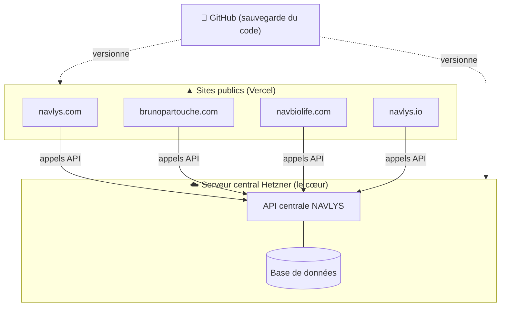

# 🧭 PLAN D'ENSEMBLE — NAVLYS (établi le 2026-06-19)

> But du document : avoir une vision claire de **où on est**, **où on veut aller**, et
> **dans quel ordre avancer sans rien casser**. Mis à jour à chaque étape franchie.

---

## 1. Ce qu'on SAIT (état réel confirmé)

- **Sites publics** : 6 projets sur **Vercel** (équipe NAVLYS). Voir `docs/CARTE-SITES.md`.
  - Actifs : navlys-app (navlys.com), brunopartouche (brunopartouche.com),
    navbio (navbiolife/navbiolive.com), navlys-teaser.
  - À vérifier (« non-live ») : navlys-io (navlys.io), brunopartouche-teaser.
- **Aucun site n'est relié à GitHub** → le code n'est sauvegardé nulle part. **Risque majeur.**
- **Serveur Hetzner** (« core central ») : système séparé, accès SSH. Contenu = « tout »
  (base de données, API, etc.) — à confirmer précisément.
- **Accès** : nouvel ordinateur Windows qui ne se connecte plus au serveur ; ancien PC OK.

## 2. Ce qu'on NE SAIT PAS ENCORE (à découvrir — Phase 1)

- ❓ Que fait exactement le « core central » Hetzner ? (API ? base de données ? back-office ?)
- ❓ Avec quelle techno les sites Vercel sont-ils faits ? (Next.js ? site statique ? autre ?)
- ❓ Les sites appellent-ils déjà une API du core ? Laquelle ? Cette connexion est-elle cassée ?
- ❓ Quelles variables d'environnement / clés API sont configurées sur chaque projet Vercel ?
- ❓ Où est le code source de chaque site aujourd'hui (uniquement sur Vercel ? sur l'ancien PC ?).

---

## 3. Où on VEUT aller (architecture cible)

Objectif exprimé : **« tout sur le serveur central, tout reconnecter en API ».**

Idée : le **core Hetzner** est le cerveau (données + API) ; les **sites Vercel** sont les
vitrines qui l'appellent en API ; **GitHub** garde une copie sûre de tout le code.

---

## 4. La FEUILLE DE ROUTE (ordre sûr, une phase à la fois)

### Phase 0 — SÉCURISER (filets de sécurité) — *à faire en premier*
- [ ] **Snapshot Hetzner** du serveur central (`docs/SAUVEGARDE.md`, niveau 1).
- [ ] Sauvegarde des données du core (`scripts/backup.sh`).
- [ ] Récupérer le code de chaque site Vercel et le mettre dans **GitHub** (sauvegarde versionnée).
- **Terminé quand** : tout le code et les données existent en copie sûre, hors production.

### Phase 1 — COMPRENDRE (inventaire / découverte)
- [ ] Documenter ce que contient/fait le core Hetzner.
- [ ] Identifier la techno de chaque site et s'il appelle déjà une API.
- [ ] Lister (sans les copier dans Git) les variables d'environnement / clés de chaque projet.
- **Terminé quand** : la section « Ce qu'on NE SAIT PAS » ci-dessus est vidée.

### Phase 2 — REMETTRE L'ACCÈS EN ORDRE
- [ ] Connecter le nouvel ordinateur au serveur (`docs/ACCES-SERVEUR.md`).
- [ ] Vérifier que le core répond et fonctionne.
- **Terminé quand** : on peut administrer le core depuis le nouveau PC, proprement.

### Phase 3 — RECONNECTER EN API
- [ ] Définir le « contrat » API : adresses, clés d'authentification, ce que chaque site demande au core.
- [ ] Configurer les variables d'environnement sur Vercel pour pointer vers le core.
- [ ] Tester chaque site un par un (en préversion avant la production).
- **Terminé quand** : chaque site dialogue correctement avec le core via API.

### Phase 4 — MODIFIER / FAIRE ÉVOLUER
- [ ] Reprendre les modifications de sites — **toujours** via `/controle`, sur branche dédiée, petits commits.
- **Terminé quand** : … c'est le travail courant, en continu.

---

## 5. Principes qui ne changent jamais (rappel)
- Une chose à la fois. On teste avant de pousser. Tout est commité.
- On sécurise AVANT de modifier. En cas de doute, on demande.
- Toute erreur → `docs/JOURNAL-ERREURS.md` + un garde-fou, pour ne jamais la refaire.

## 6. Décision attendue de l'utilisateur pour démarrer la Phase 0
Une fois ce plan validé : on commence par le **snapshot Hetzner** + la **sauvegarde du code
du site principal (navlys-app) dans GitHub**. Dis-moi « on y va » ou ce que tu veux ajuster.
